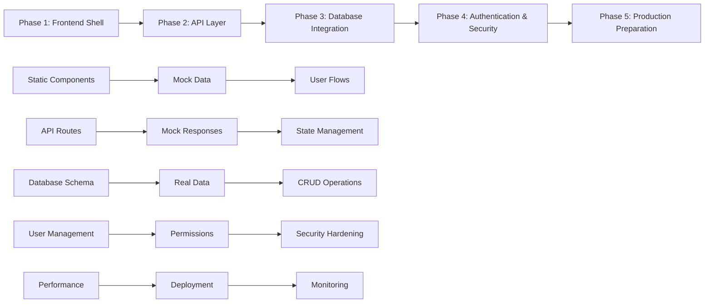

# Sudokru - Prototyping Roadmap Document

## 1. Frontend-First Prototyping Philosophy

### 1.1 Core Principles
- **Visual Progress First:** Build what users can see and interact with immediately
- **Rapid Iteration:** Enable quick feedback loops with stakeholders and users
- **Progressive Enhancement:** Start simple, add complexity incrementally
- **Risk Reduction:** Validate UX/UI before investing in complex backend systems
- **Stakeholder Engagement:** Provide tangible progress demonstrations early

### 1.2 Frontend-First Advantages for Sudokru
- **Real-time Gaming Focus:** UI interactions are critical for competitive gaming experience
- **Complex Game States:** Visual validation of Sudoku grid logic before backend complexity
- **User Feedback Early:** Tournament brackets, leaderboards, and social features need user validation
- **Mobile Responsiveness:** Gaming on mobile requires extensive UI testing and optimization
- **Accessibility Compliance:** Gaming interfaces need thorough accessibility validation

## 2. Five-Phase Development Approach

### 2.1 Phase Progression Strategy



## 3. Phase 1: Frontend Shell & Components (Weeks 1-2)

### 3.1 Objectives
- Create fully interactive frontend with mock data
- Establish component library and design system
- Validate all major user flows
- Build confidence in UX decisions

### 3.2 Deliverables Checklist

**✅ Project Setup**
- [ ] Next.js 14+ project with TypeScript configured
- [ ] Tailwind CSS + shadcn/ui component library installed
- [ ] ESLint, Prettier, and TypeScript strict mode enabled
- [ ] Git repository with proper .gitignore
- [ ] Development scripts configured (dev, build, lint, test)

**✅ Design System Implementation**
- [ ] Color palette and typography defined
- [ ] Base UI components created (Button, Input, Card, etc.)
- [ ] Gaming-specific components (SudokuGrid, GameStatus, PlayerList)
- [ ] Responsive breakpoints established
- [ ] Dark/light theme support (optional)

**✅ Core Page Layouts**
- [ ] Landing page with hero section and features
- [ ] Authentication pages (login, register, forgot password)
- [ ] Dashboard layout with navigation
- [ ] Game room interface with grid and controls
- [ ] Tournament listing and bracket views
- [ ] User profile and settings pages

**✅ Mock Data Integration**
```typescript
// Example mock data structure
export const mockData = {
  users: [
    {
      id: '1',
      username: 'sudoku_master',
      displayName: 'Sudoku Master',
      rating: 1650,
      gamesPlayed: 127,
      winRate: 0.73
    }
  ],
  games: [
    {
      id: 'game1',
      type: 'competitive',
      difficulty: 'medium',
      status: 'active',
      players: ['1', '2'],
      puzzle: {
        initialGrid: [[5,3,0,0,7,0,0,0,0], /* ... */],
        solution: [[5,3,4,6,7,8,9,1,2], /* ... */]
      }
    }
  ],
  tournaments: [
    {
      id: 'tournament1',
      name: 'Weekly Championship',
      status: 'registration',
      maxPlayers: 64,
      currentPlayers: 23,
      startTime: '2024-03-15T18:00:00Z'
    }
  ]
};
```

**✅ Interactive User Flows**
- [ ] User registration and login flow (mock)
- [ ] Game creation and joining process
- [ ] Sudoku gameplay with move validation (client-side)
- [ ] Tournament registration and bracket navigation
- [ ] Friend system and social interactions
- [ ] Settings and profile management

**✅ Component Documentation**
- [ ] Storybook setup with component examples
- [ ] Component API documentation
- [ ] Design system documentation
- [ ] Usage examples for each component

### 3.3 Success Criteria
- ✅ All major user journeys demonstrable with mock data
- ✅ Responsive design works on mobile, tablet, and desktop
- ✅ Component library is reusable and well-documented
- ✅ Stakeholders can interact with and provide feedback on UX
- ✅ No real backend dependencies

### 3.4 Phase 1 Development Scripts
```json
{
  "scripts": {
    "dev": "next dev",
    "build": "next build",
    "start": "next start",
    "lint": "next lint --fix",
    "type-check": "tsc --noEmit",
    "storybook": "storybook dev -p 6006",
    "test": "jest --watch",
    "mock-data": "tsx scripts/generate-mock-data.ts"
  }
}
```

## 4. Phase 2: API Layer Development (Weeks 3-4)

### 4.1 Objectives
- Add structured API layer while maintaining frontend functionality
- Implement proper TypeScript interfaces for API contracts
- Add form handling and client-side validation
- Create realistic API simulation layer

### 4.2 Deliverables Checklist

**✅ API Route Structure**
```typescript
// API route organization
src/app/api/
├── auth/
│   ├── login/route.ts
│   ├── register/route.ts
│   └── refresh/route.ts
├── games/
│   ├── route.ts              // GET /api/games, POST /api/games
│   ├── [gameId]/
│   │   ├── route.ts          // GET/PUT/DELETE /api/games/[id]
│   │   ├── join/route.ts     // POST /api/games/[id]/join
│   │   └── moves/route.ts    // POST /api/games/[id]/moves
│   └── public/route.ts       // GET /api/games/public
├── tournaments/
│   ├── route.ts
│   └── [tournamentId]/
│       ├── route.ts
│       ├── register/route.ts
│       └── bracket/route.ts
└── users/
    ├── me/route.ts
    ├── [userId]/route.ts
    └── search/route.ts
```

**✅ Mock API Implementation**
```typescript
// Example API route with mock data
// src/app/api/games/route.ts
import { NextRequest, NextResponse } from 'next/server';
import { mockData } from '@/lib/mock-data';

export async function GET(request: NextRequest) {
  // Simulate API delay
  await new Promise(resolve => setTimeout(resolve, 300));
  
  // Mock filtering and pagination
  const { searchParams } = new URL(request.url);
  const difficulty = searchParams.get('difficulty');
  const status = searchParams.get('status');
  
  let games = mockData.games;
  
  if (difficulty) {
    games = games.filter(game => game.difficulty === difficulty);
  }
  
  if (status) {
    games = games.filter(game => game.status === status);
  }
  
  return NextResponse.json({
    games,
    pagination: {
      page: 1,
      limit: 20,
      total: games.length,
      totalPages: 1
    }
  });
}

export async function POST(request: NextRequest) {
  const body = await request.json();
  
  // Validate request body
  const gameData = {
    id: generateId(),
    ...body,
    status: 'waiting',
    players: [],
    createdAt: new Date().toISOString()
  };
  
  // Add to mock data
  mockData.games.push(gameData);
  
  return NextResponse.json(gameData, { status: 201 });
}
```

**✅ TypeScript API Contracts**
```typescript
// src/types/api.ts
export interface ApiResponse<T> {
  data?: T;
  error?: string;
  message?: string;
  pagination?: PaginationInfo;
}

export interface GameCreateRequest {
  type: 'competitive' | 'collaborative' | 'practice';
  difficulty: 'easy' | 'medium' | 'hard' | 'expert';
  maxPlayers: number;
  timeLimit?: number;
  isPrivate: boolean;
}

export interface GameJoinRequest {
  role: 'player' | 'spectator';
}

export interface GameMoveRequest {
  row: number;
  col: number;
  value: number;
  moveType: 'place' | 'clear' | 'note';
}
```

**✅ State Management Integration**
```typescript
// Update Zustand store to use API calls
export const useGameStore = create<GameStore>((set, get) => ({
  games: [],
  currentGame: null,
  isLoading: false,
  
  fetchGames: async (filters?: GameFilters) => {
    set({ isLoading: true });
    try {
      const response = await fetch('/api/games?' + new URLSearchParams(filters));
      const data = await response.json();
      set({ games: data.games, isLoading: false });
    } catch (error) {
      set({ isLoading: false });
      // Handle error
    }
  },
  
  createGame: async (gameData: GameCreateRequest) => {
    const response = await fetch('/api/games', {
      method: 'POST',
      headers: { 'Content-Type': 'application/json' },
      body: JSON.stringify(gameData),
    });
    
    if (!response.ok) throw new Error('Failed to create game');
    
    const newGame = await response.json();
    set(state => ({ games: [...state.games, newGame] }));
    return newGame;
  }
}));
```

**✅ Form Handling & Validation**
- [ ] React Hook Form integration with Zod validation
- [ ] Form components with proper error handling
- [ ] Client-side validation for all user inputs
- [ ] Loading states and error messages for forms

**✅ Error Handling Implementation**
- [ ] API error response standardization
- [ ] Error boundary components
- [ ] Toast notifications for user feedback
- [ ] Loading and error states for all API calls

### 4.3 Success Criteria
- ✅ All frontend components work with API layer
- ✅ API contracts documented and type-safe
- ✅ Form validation prevents invalid submissions
- ✅ Error handling provides clear user feedback
- ✅ Loading states improve perceived performance

## 5. Phase 3: Database Integration (Weeks 5-7)

### 5.1 Objectives
- Replace mock data with real database functionality
- Implement complete CRUD operations
- Add data validation and sanitization
- Establish database schema and migrations

### 5.2 Deliverables Checklist

**✅ Database Setup**
- [ ] Prisma schema defined and documented
- [ ] SQLite configured for development
- [ ] Database migrations created and tested
- [ ] Seed data script for development environment
- [ ] Database connection and error handling

**✅ Schema Implementation**
```prisma
// Key schema models
model User {
  id            String    @id @default(cuid())
  email         String    @unique
  username      String    @unique
  passwordHash  String?
  
  profile       UserProfile?
  statistics    UserStatistics?
  
  playerGames   PlayerGame[]
  createdGames  Game[]       @relation("GameCreator")
  
  createdAt DateTime @default(now())
  updatedAt DateTime @updatedAt
  
  @@map("users")
}

model Game {
  id        String @id @default(cuid())
  puzzleId  String
  puzzle    Puzzle @relation(fields: [puzzleId], references: [id])
  
  type      String // competitive, collaborative, practice
  difficulty String // easy, medium, hard, expert
  status    String @default("waiting") // waiting, active, completed
  
  creatorId String
  creator   User   @relation("GameCreator", fields: [creatorId], references: [id])
  
  players   PlayerGame[]
  moves     GameMove[]
  
  createdAt DateTime @default(now())
  
  @@map("games")
}
```

**✅ CRUD Operations**
```typescript
// Database service layer
export class GameService {
  async createGame(creatorId: string, gameData: GameCreateRequest): Promise<Game> {
    return await prisma.game.create({
      data: {
        type: gameData.type,
        difficulty: gameData.difficulty,
        creatorId,
        puzzle: {
          create: generatePuzzle(gameData.difficulty)
        }
      },
      include: {
        creator: { select: { username: true } },
        puzzle: true,
        players: { include: { user: true } }
      }
    });
  }

  async joinGame(gameId: string, userId: string, role: 'player' | 'spectator'): Promise<void> {
    await prisma.playerGame.create({
      data: {
        gameId,
        userId,
        role,
        status: 'joined'
      }
    });
  }

  async makeMove(gameId: string, userId: string, move: GameMoveRequest): Promise<GameMoveResponse> {
    return await prisma.$transaction(async (tx) => {
      // Validate move
      const game = await tx.game.findUnique({
        where: { id: gameId },
        include: { puzzle: true }
      });

      if (!game || game.status !== 'active') {
        throw new Error('Game not active');
      }

      // Record move
      await tx.gameMove.create({
        data: {
          gameId,
          userId,
          row: move.row,
          col: move.col,
          value: move.value,
          moveType: move.moveType,
          timeFromStart: Date.now() - game.createdAt.getTime(),
          isCorrect: validateSudokuMove(game.puzzle.solution, move)
        }
      });

      // Update player state
      await tx.playerGame.update({
        where: { gameId_userId: { gameId, userId } },
        data: {
          moveCount: { increment: 1 },
          errorCount: move.isCorrect ? undefined : { increment: 1 }
        }
      });

      return { isValid: move.isCorrect };
    });
  }
}
```

**✅ Data Migration Scripts**
- [ ] Migration from mock data to database structure
- [ ] Data import/export utilities
- [ ] Database reset and seed scripts
- [ ] Migration rollback procedures

**✅ Performance Optimization**
- [ ] Database indexes for critical queries
- [ ] Connection pooling configuration
- [ ] Query optimization for game data
- [ ] Caching strategy for frequently accessed data

### 5.3 Success Criteria
- ✅ All application features work with real database
- ✅ Data persistence across application restarts
- ✅ Database queries perform within acceptable limits
- ✅ Data integrity maintained through transactions
- ✅ Migration path from development to production database

## 6. Phase 4: Authentication & Security (Weeks 8-9)

### 6.1 Objectives
- Implement secure user authentication system
- Add role-based access control
- Implement session management
- Add input validation and security measures

### 6.2 Deliverables Checklist

**✅ Authentication System**
- [ ] NextAuth.js configured with multiple providers
- [ ] JWT token generation and validation
- [ ] Session management with Redis caching
- [ ] Password hashing and validation
- [ ] Email verification flow

**✅ Authorization Framework**
```typescript
// Permission system implementation
export const ROLE_PERMISSIONS = {
  [UserRole.GUEST]: [
    Permission.GAME_SPECTATE,
    Permission.TOURNAMENT_VIEW,
  ],
  [UserRole.USER]: [
    Permission.GAME_CREATE,
    Permission.GAME_JOIN,
    Permission.SOCIAL_FRIEND_REQUEST,
    // ... more permissions
  ],
  [UserRole.PREMIUM]: [
    // All user permissions plus:
    Permission.GAME_PRIVATE_CREATE,
    Permission.TOURNAMENT_JOIN_PREMIUM,
    // ... premium features
  ]
};

// Middleware for route protection
export function withAuth(
  handler: (req: AuthenticatedRequest) => Promise<NextResponse>,
  requiredPermissions: Permission[] = []
) {
  return async (request: NextRequest): Promise<NextResponse> => {
    const token = extractToken(request);
    const user = await validateToken(token);
    
    if (!user) {
      return NextResponse.json({ error: 'Unauthorized' }, { status: 401 });
    }

    if (!hasPermissions(user, requiredPermissions)) {
      return NextResponse.json({ error: 'Forbidden' }, { status: 403 });
    }

    return handler({ ...request, user });
  };
}
```

**✅ Security Measures**
- [ ] Input validation with Zod schemas
- [ ] SQL injection prevention (Prisma ORM)
- [ ] XSS protection with Content Security Policy
- [ ] Rate limiting implementation
- [ ] CORS configuration
- [ ] Security headers configuration

**✅ Session Security**
- [ ] Secure session storage
- [ ] Session invalidation on logout
- [ ] Concurrent session management
- [ ] Session activity monitoring
- [ ] Automatic session cleanup

### 6.3 Success Criteria
- ✅ Users can securely register and authenticate
- ✅ Role-based permissions properly enforced
- ✅ Sessions managed securely with proper expiration
- ✅ Security vulnerabilities addressed and tested
- ✅ Authentication flows work across all user types

## 7. Phase 5: Production Preparation (Weeks 10-12)

### 7.1 Objectives
- Optimize application for production deployment
- Implement comprehensive monitoring and logging
- Set up CI/CD pipeline
- Perform security audits and performance testing

### 7.2 Deliverables Checklist

**✅ Production Database Migration**
- [ ] PostgreSQL setup and configuration
- [ ] Data migration from SQLite to PostgreSQL
- [ ] Connection pooling and optimization
- [ ] Backup and recovery procedures
- [ ] Database monitoring setup

**✅ Performance Optimization**
```typescript
// Next.js optimization configuration
// next.config.js
module.exports = {
  experimental: {
    appDir: true,
    serverComponentsExternalPackages: ['@prisma/client'],
  },
  images: {
    domains: ['cdn.sudokru.com'],
    formats: ['image/webp', 'image/avif'],
  },
  async headers() {
    return [
      {
        source: '/(.*)',
        headers: [
          {
            key: 'X-Frame-Options',
            value: 'DENY',
          },
          {
            key: 'X-Content-Type-Options',
            value: 'nosniff',
          },
          {
            key: 'Strict-Transport-Security',
            value: 'max-age=31536000; includeSubDomains',
          },
        ],
      },
    ];
  },
  webpack: (config, { dev, isServer }) => {
    if (!dev && !isServer) {
      config.optimization.splitChunks = {
        chunks: 'all',
        cacheGroups: {
          vendor: {
            test: /[\\/]node_modules[\\/]/,
            name: 'vendors',
            chunks: 'all',
          },
        },
      };
    }
    return config;
  },
};
```

**✅ Monitoring & Logging**
- [ ] Error tracking with Sentry
- [ ] Performance monitoring with Core Web Vitals
- [ ] Custom application metrics
- [ ] Log aggregation and analysis
- [ ] Alert configuration for critical issues

**✅ CI/CD Pipeline**
```yaml
# .github/workflows/deploy.yml
name: Deploy to Production

on:
  push:
    branches: [main]

jobs:
  test:
    runs-on: ubuntu-latest
    steps:
      - uses: actions/checkout@v4
      - name: Setup Node.js
        uses: actions/setup-node@v4
        with:
          node-version: '18'
          cache: 'npm'
      - name: Install dependencies
        run: npm ci
      - name: Run tests
        run: npm run test:ci
      - name: Run E2E tests
        run: npm run e2e:ci

  deploy:
    needs: test
    runs-on: ubuntu-latest
    steps:
      - uses: actions/checkout@v4
      - name: Deploy to Vercel
        uses: amondnet/vercel-action@v25
        with:
          vercel-token: ${{ secrets.VERCEL_TOKEN }}
          vercel-org-id: ${{ secrets.VERCEL_ORG_ID }}
          vercel-project-id: ${{ secrets.VERCEL_PROJECT_ID }}
          vercel-args: '--prod'
```

**✅ Security Audit**
- [ ] Dependency security audit (npm audit)
- [ ] OWASP security checklist compliance
- [ ] Penetration testing results
- [ ] Security headers validation
- [ ] SSL/TLS configuration verification

**✅ Documentation & Handoff**
- [ ] API documentation (OpenAPI/Swagger)
- [ ] Deployment documentation
- [ ] Environment configuration guide
- [ ] Monitoring and alerting documentation
- [ ] Troubleshooting guide

### 7.3 Success Criteria
- ✅ Application deployed successfully to production
- ✅ Performance metrics meet requirements
- ✅ Security audit passes with no critical issues
- ✅ Monitoring and alerting systems operational
- ✅ Documentation complete for ongoing maintenance

## 8. Documentation Priorities by Phase

### 8.1 Phase 1 Documentation Requirements
- **Component Library Documentation:** Storybook with usage examples
- **Design System Specification:** Colors, typography, spacing guidelines
- **Wireframes/Low-Fi Mockups:** User flow documentation
- **Project Folder Structure:** Initial organization patterns

### 8.2 Phase 2 Documentation Requirements
- **API Specification (OpenAPI):** All endpoint documentation
- **Frontend Architecture Document:** State management and component patterns
- **Error Handling Standards:** Error types and user messaging

### 8.3 Phase 3 Documentation Requirements
- **Database Schema Documentation:** Complete entity relationships
- **Data Flow Diagrams:** How data moves through the system
- **Environment Configuration Guide:** Development setup instructions

### 8.4 Phase 4 Documentation Requirements
- **Authentication & Authorization Schema:** User roles and permissions
- **Security Guidelines:** Implementation standards and best practices

### 8.5 Phase 5 Documentation Requirements
- **Performance Requirements & Monitoring:** Metrics and optimization targets
- **CI/CD Pipeline Documentation:** Deployment and release processes

## 9. Risk Mitigation Strategies

### 9.1 Technical Risks
**Risk:** Frontend-first approach leads to unrealistic UI expectations
**Mitigation:** Regular backend feasibility reviews, realistic mock data

**Risk:** API contract changes require significant frontend refactoring
**Mitigation:** TypeScript interfaces, comprehensive API testing

**Risk:** Database schema changes break existing functionality
**Mitigation:** Migration scripts, comprehensive testing, rollback procedures

### 9.2 Timeline Risks
**Risk:** Phase dependencies cause delays
**Mitigation:** Parallel development where possible, flexible scope adjustment

**Risk:** Stakeholder feedback requires major changes
**Mitigation:** Regular demos, incremental feedback incorporation

**Risk:** Technical complexity exceeds estimates
**Mitigation:** Spike investigations, expert consultation, scope reduction

### 9.3 Quality Risks
**Risk:** Rapid development compromises code quality
**Mitigation:** Code reviews, automated testing, refactoring sprints

**Risk:** Security vulnerabilities introduced
**Mitigation:** Security reviews at each phase, automated security scanning

## 10. Success Metrics by Phase

### 10.1 Phase 1 Metrics
- ✅ 100% of user flows demonstrable with mock data
- ✅ Component library has 90%+ test coverage
- ✅ Responsive design works on 3+ device types
- ✅ Stakeholder approval on UX/UI design

### 10.2 Phase 2 Metrics
- ✅ API contracts defined for 100% of endpoints
- ✅ All forms have proper validation
- ✅ Error handling covers 95% of failure scenarios
- ✅ State management is type-safe and predictable

### 10.3 Phase 3 Metrics
- ✅ Database queries perform under 100ms for 95th percentile
- ✅ Data integrity maintained through all operations
- ✅ 100% of mock data successfully migrated
- ✅ Database schema supports all planned features

### 10.4 Phase 4 Metrics
- ✅ Authentication system supports all user types
- ✅ Security audit shows no critical vulnerabilities
- ✅ Permission system properly enforces access control
- ✅ Session management handles concurrent users

### 10.5 Phase 5 Metrics
- ✅ Page load times under 2 seconds on 3G
- ✅ Core Web Vitals pass for all key pages
- ✅ Uptime target of 99.5% achieved
- ✅ Monitoring catches 100% of critical errors

## 11. Transition Planning

### 11.1 Phase Handoff Procedures
Each phase concludes with:
- ✅ Feature demonstration to stakeholders
- ✅ Code review and documentation update
- ✅ Testing completion and bug resolution
- ✅ Next phase planning and preparation

### 11.2 Stakeholder Communication
- **Weekly demos** during active development
- **Phase completion presentations** with metrics review
- **Feedback incorporation planning** sessions
- **Technical architecture reviews** with development team

This frontend-first prototyping roadmap ensures Sudokru development proceeds with maximum stakeholder visibility, minimal technical risk, and optimal user experience validation at each stage. '