# Sudokru - Data Flow Diagrams

## 1. System Architecture Data Flow

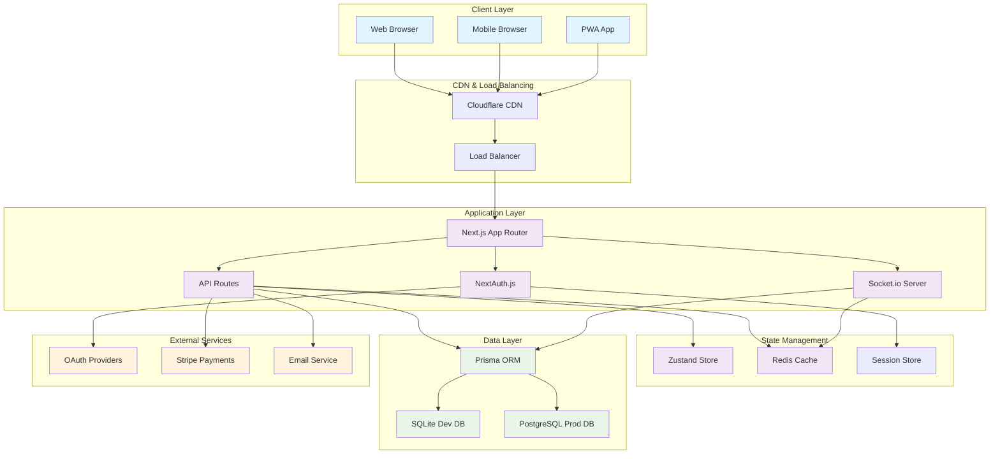

## 2. User Authentication Data Flow

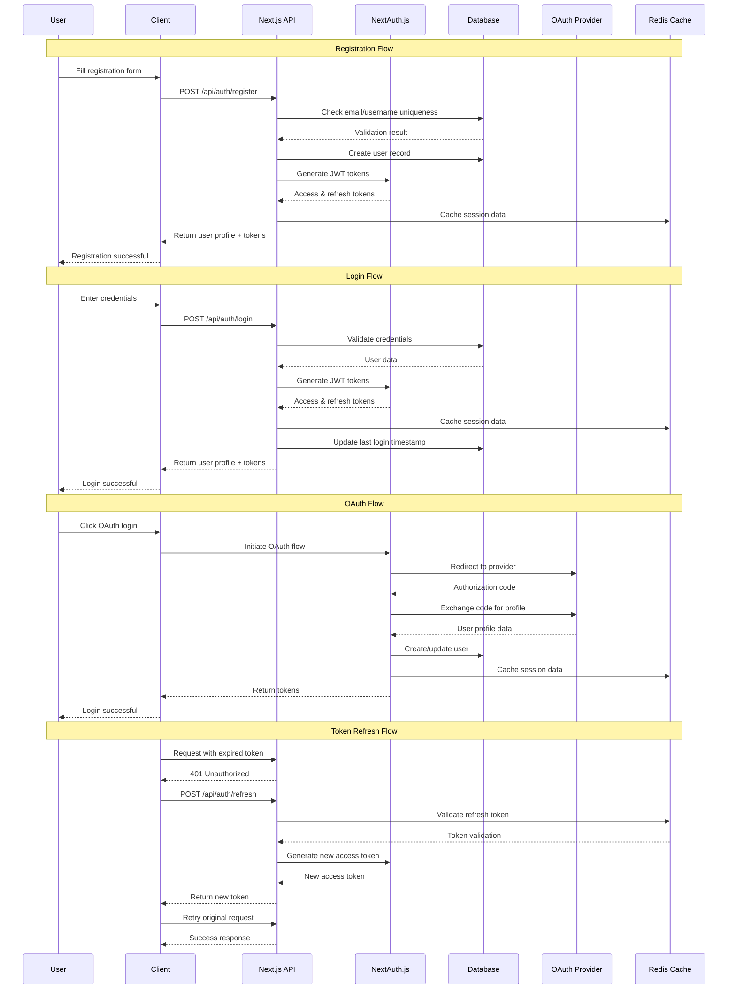

## 3. Real-time Game Data Flow

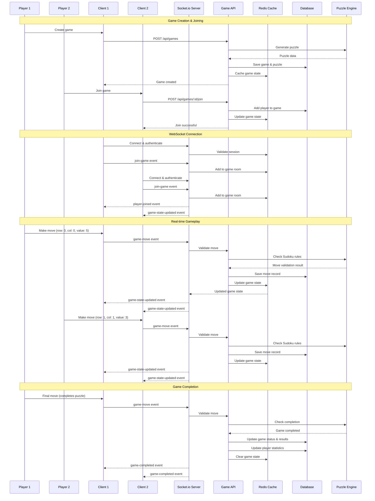

## 4. Tournament System Data Flow

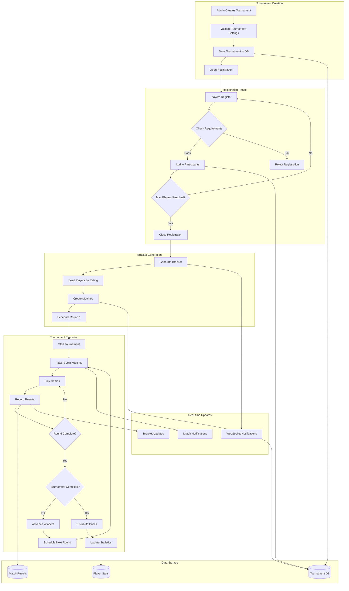

## 5. State Management Data Flow

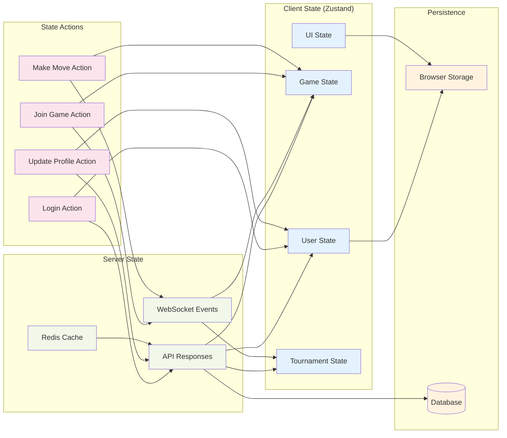

## 6. Database Transaction Flow

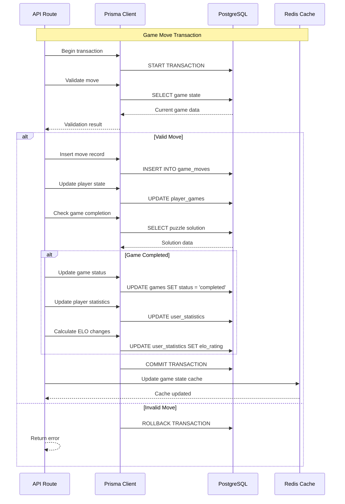

## 7. Caching Strategy Data Flow

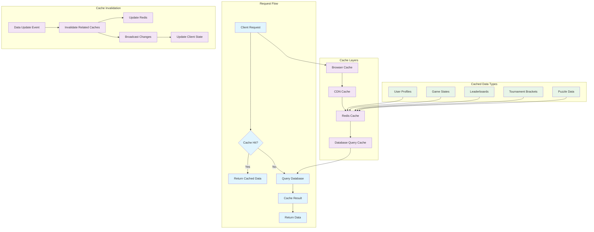

## 8. Payment Processing Data Flow

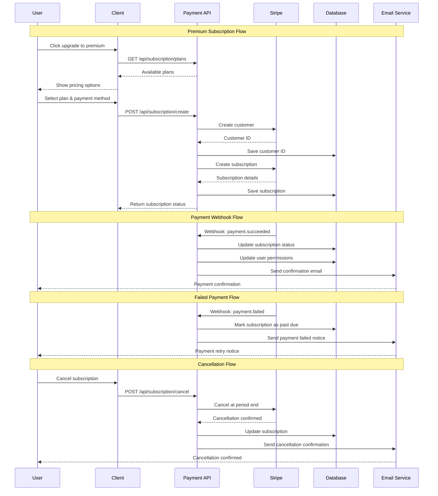

## 9. Error Handling Data Flow

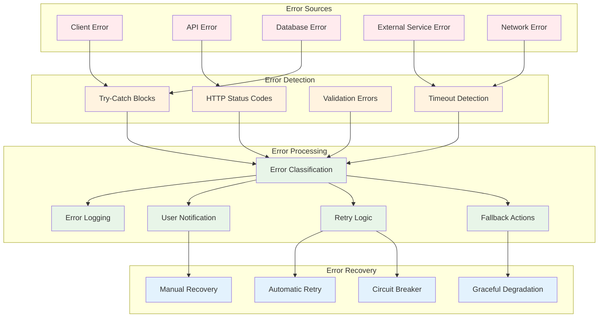

## 10. Analytics Data Flow

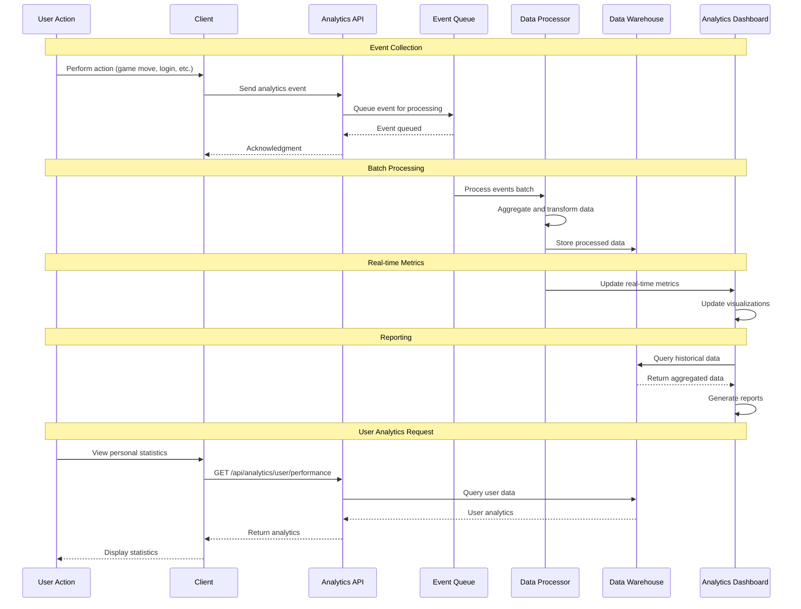

## 11. Security Data Flow

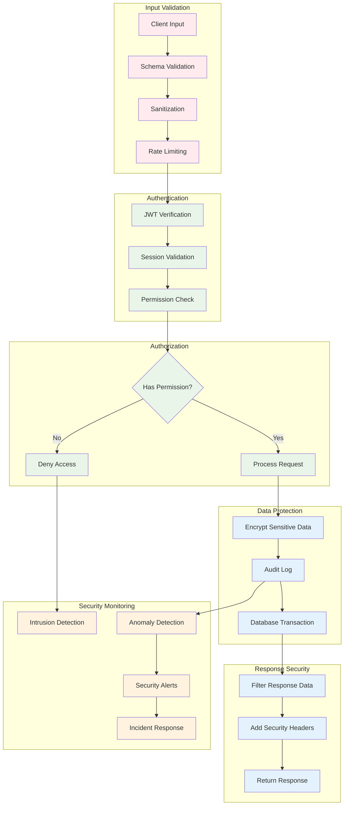

## 12. Mobile PWA Data Flow

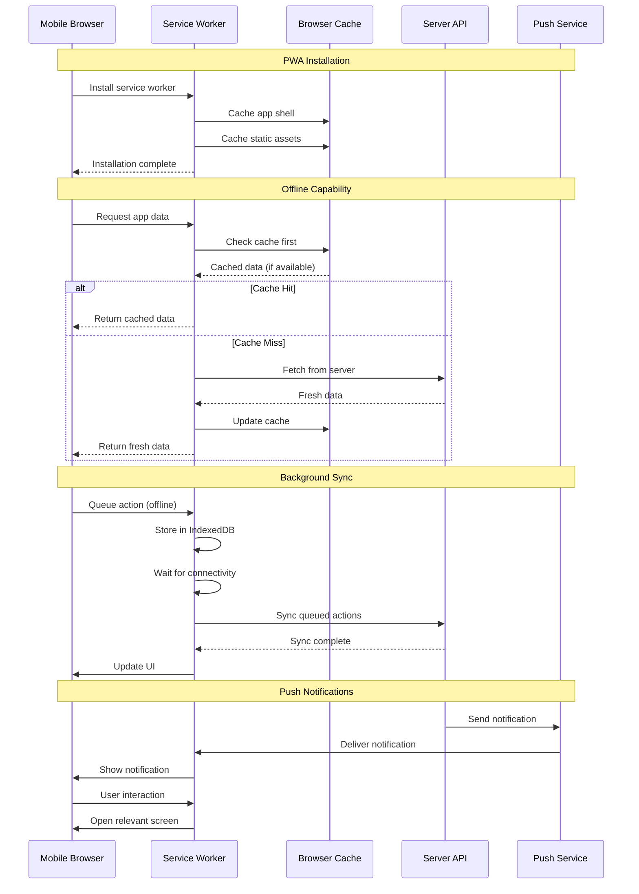

## Data Flow Optimization Strategies

### 1. Real-time Performance Optimization

```yaml
websocket_optimization:
  connection_pooling:
    description: "Reuse WebSocket connections across multiple game rooms"
    implementation: "Socket.io namespaces and rooms"
    benefits: "Reduced memory usage, better scalability"
    
  message_batching:
    description: "Batch multiple game state updates into single message"
    implementation: "Accumulate updates over 50ms window"
    benefits: "Reduced network overhead, smoother UI updates"
    
  selective_broadcasting:
    description: "Send updates only to relevant players/spectators"
    implementation: "Room-based message filtering"
    benefits: "Reduced bandwidth, improved privacy"

database_optimization:
  connection_pooling:
    description: "Maintain persistent database connections"
    configuration: "Max 100 connections, 30s timeout"
    benefits: "Reduced connection overhead"
    
  query_optimization:
    description: "Use indexes and optimized queries for real-time data"
    implementation: "Composite indexes on game_id + timestamp"
    benefits: "Sub-100ms query response times"
    
  read_replicas:
    description: "Use read replicas for analytics and leaderboards"
    implementation: "Master-slave PostgreSQL setup"
    benefits: "Reduced load on primary database"
```

### 2. Caching Strategy Details

```yaml
cache_layers:
  browser_cache:
    duration: "Static assets: 1 year, API responses: 5 minutes"
    invalidation: "Version-based for assets, ETag for API"
    
  cdn_cache:
    duration: "Static assets: 1 year, dynamic content: 1 hour"
    invalidation: "Webhook-triggered purge on updates"
    
  redis_cache:
    game_states: "TTL: 2 hours, updated on every move"
    user_sessions: "TTL: 24 hours, sliding expiration"
    leaderboards: "TTL: 5 minutes, updated on game completion"
    puzzle_cache: "TTL: 24 hours, 1000 puzzles per difficulty"
    
  database_cache:
    query_cache: "Built-in PostgreSQL query cache"
    prepared_statements: "Prisma prepared statement cache"
```

### 3. Error Recovery Patterns

```yaml
retry_strategies:
  exponential_backoff:
    initial_delay: 100ms
    max_delay: 30s
    max_attempts: 5
    jitter: true
    
  circuit_breaker:
    failure_threshold: 5
    timeout: 30s
    recovery_time: 60s
    
  graceful_degradation:
    game_moves: "Store locally, sync when connection restored"
    leaderboards: "Show cached data with staleness indicator"
    tournaments: "Allow offline viewing, block registration"

connection_resilience:
  websocket_reconnection:
    automatic: true
    max_attempts: 10
    backoff_strategy: "exponential"
    
  http_request_retry:
    idempotent_requests: "Auto-retry with exponential backoff"
    non_idempotent: "User confirmation required"
    
  offline_support:
    single_player: "Full offline capability"
    multiplayer: "Queue actions for sync"
```

### 4. State Synchronization Patterns

```yaml
client_state_sync:
  optimistic_updates:
    description: "Update UI immediately, rollback if server rejects"
    use_cases: ["Game moves", "Profile updates", "Chat messages"]
    rollback_strategy: "Restore previous state + error notification"
    
  conflict_resolution:
    strategy: "Server state always wins"
    implementation: "Compare timestamps and sequence numbers"
    user_notification: "Show conflict resolution to user"
    
  state_reconciliation:
    frequency: "On reconnection and every 30 seconds"
    method: "Delta sync with version vectors"
    fallback: "Full state refresh if delta fails"

server_state_sync:
  database_consistency:
    isolation_level: "READ_COMMITTED"
    transaction_strategy: "Short-lived transactions"
    deadlock_handling: "Automatic retry with backoff"
    
  cache_consistency:
    write_through: "Update cache immediately after database"
    invalidation: "Event-driven cache invalidation"
    eventual_consistency: "Acceptable for analytics data"
```

### 5. Analytics Data Pipeline

```yaml
data_collection:
  client_events:
    - user_action: "Click, scroll, focus events"
    - game_events: "Moves, errors, completion times"
    - performance: "Load times, error rates"
    - engagement: "Session duration, feature usage"
    
  server_events:
    - api_calls: "Response times, error rates"
    - database: "Query performance, connection metrics"
    - business: "User registrations, subscription changes"
    
data_processing:
  real_time:
    tool: "Redis Streams"
    use_cases: ["Live leaderboards", "Real-time dashboards"]
    latency: "<1 second"
    
  batch_processing:
    tool: "Scheduled jobs"
    frequency: "Hourly for reports, daily for aggregations"
    use_cases: ["User analytics", "Business intelligence"]
    
data_storage:
  time_series: "Game performance metrics"
  aggregated: "Daily/weekly/monthly summaries"
  raw_events: "30-day retention for debugging"
```

This comprehensive data flow documentation provides detailed insights into how data moves through the Sudokru system, from user interactions to database storage, including real-time gaming, authentication, payments, and analytics. The diagrams and optimization strategies ensure efficient, scalable, and reliable data handling across all system components.